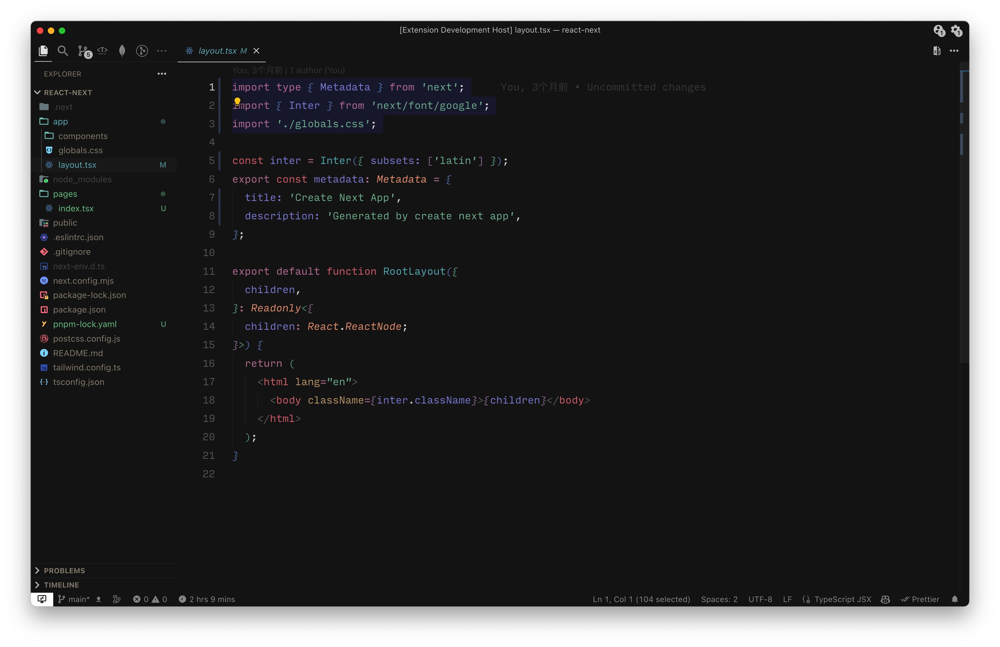
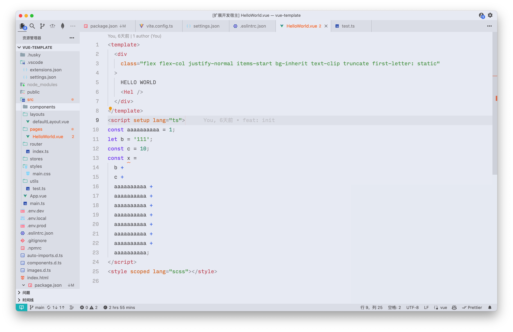

# Seaci-Theme for VSCode

---

<b>Dark-theme: </b>

<b>Light-theme: </b>

**A nice looking dark theme for VSCode.**

## INSTALLATION

1. Open Extensions on VSCode.
2. Search `Seaci theme`.
3. Select `Seaci theme` and install.

## THANKS

The Dark-theme is based on [Moegi Theme](https://github.com/moegi-design/vscode-theme).

The Light-theme is based on [Eva Theme](https://github.com/fisheva/Eva-Theme).

## LICENSE

[MIT License](LICENSE)

**Enjoy!**
